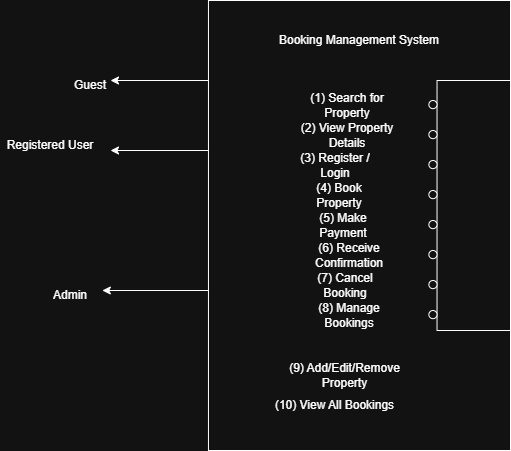

# Requirement Analysis in Software Development

This repository is dedicated to documenting and demonstrating the principles of Requirement Analysis within the Software Development Life Cycle (SDLC). It covers key activities, types of requirements, use case diagrams, and acceptance criteria — all structured around a booking management system case study.

## What is Requirement Analysis?

Requirement Analysis is a fundamental phase in the Software Development Life Cycle (SDLC) where developers gather, analyze, and define the requirements of the system to be developed. It ensures that all stakeholders have a shared understanding of what the system must achieve and how it should behave.

### Key Objectives:
- Define system expectations clearly.
- Align development with business goals.
- Avoid scope creep and miscommunication.

Requirement Analysis lays the foundation for successful design, implementation, and delivery of software products.

## Why is Requirement Analysis Important?

- **Clarity & Understanding**: Helps teams capture stakeholder expectations clearly, reducing miscommunication and costly revisions.
- **Defines Project Scope**: Prevents scope creep by setting clear boundaries on what the software should do.
- **Supports Quality Delivery**: Ensures the product meets user needs and business objectives, resulting in higher satisfaction.

## Key Activities in Requirement Analysis

- **Requirement Gathering** 🗂️  
  Interviews, surveys, workshops, and document reviews to collect needs from stakeholders.

- **Requirement Elicitation** ✍️  
  Brainstorming, prototyping, and focus groups to uncover and refine user needs.

- **Requirement Documentation** 📚  
  Creating requirement specification documents, user stories, and use cases.

- **Requirement Analysis and Modeling** 📊  
  Prioritizing, validating, and modeling requirements using diagrams and feasibility studies.

- **Requirement Validation** ✅  
  Confirming that requirements align with user needs, and establishing acceptance criteria.

## Types of Requirements

### Functional Requirements ⚙️

Functional requirements describe what the system should do.

**Examples for Booking Management System:**
- **Property Search**: Users can search for properties by location, price, and date.
- **Booking Management**: Users can make, cancel, or modify bookings.
- **User Authentication**: Users can register, log in, and reset passwords.

### Non-functional Requirements 🛡️

Non-functional requirements define how the system performs.

**Examples:**
- **Performance**: System should load within 2 seconds and support 1000+ users.
- **Security**: User data must be encrypted and protected from unauthorized access.
- **Usability**: Interface must be user-friendly and responsive.
- **Scalability**: System should scale to handle increased bookings or new regions.

## Use Case Diagrams

Use Case Diagrams visually represent how users (actors) interact with the system. They help developers understand the system's functionality from the user's perspective.

**Benefits:**
- Clarifies system boundaries and responsibilities
- Helps identify key use cases and actors
- Improves communication among stakeholders

### Booking Management System Use Case Diagram:

## Acceptance Criteria

Acceptance Criteria are specific conditions that a software feature must meet to be accepted by stakeholders.

**Why it Matters:**
- Defines when a feature is "done"
- Reduces ambiguity between developers and clients
- Supports effective testing and validation

**Example – Checkout Feature:**
> As a user, I want to complete a property booking and receive a confirmation email within 2 minutes.

**Acceptance Criteria:**
- User must be able to select available dates and proceed to checkout.
- System must validate and process payment securely.
- A confirmation page must be shown instantly.
- Confirmation email must be sent within 2 minutes after booking.
